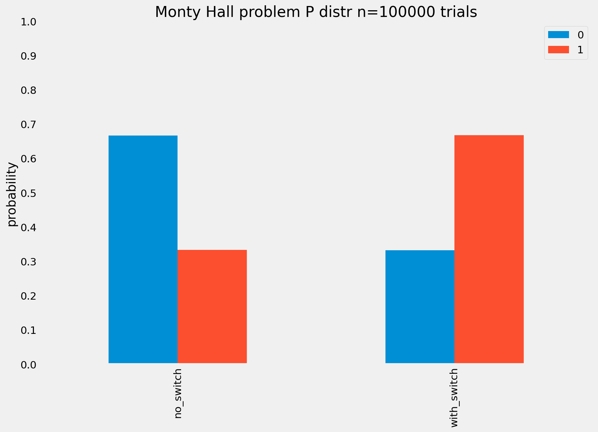

# monty_hall_sim

A frequentist attempt to simulate bayesian probability illusion.
 
[Problem description](https://www.lesswrong.com/posts/rRRCEoCXDSiv4dQvM/monty-hall-in-the-wild)

## Simulation results

